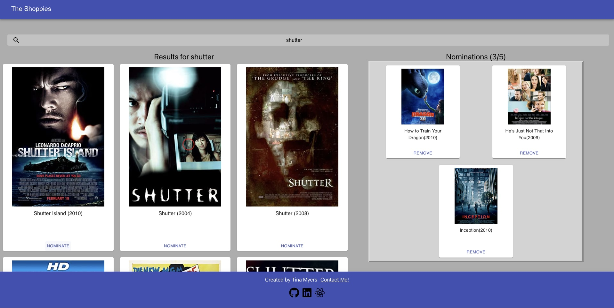

<h1 align="center">
The Shoppies Movie Store
</h1>

<p align="center">Search for your favorite movie and nominate them for the coveted "Shoppie" award!</p>

</h3>
<h3 align="center">
<p>Deployed On Netlify</p>
<a href="https://tinamyers-shoppies.herokuapp.com/">Click here to check out the app 🔗</a>
</h3>



### Features included

- Search by movie title
- Nominate 5 choices
- Remove one or more nominations
- See nominations
- Error Handling
- Alert when nominations are complete
- Nominations are saved locally if you navigate away from the page
- Upon return to the page, nominations show up automatically

### Technologies Used

- React
- SASS/SCSS
- Material UI
- Bootstrap
- Local Storage
- [OMDB API](http://www.omdbapi.com/)
- Font Awesome contact links

### Developer Setup

Clone Repo:

```git clone {repo link}```

```npm i```

Run on localhost:3000

```npm start```

### Connect with me!

[Portfolio](https://tina-myers-portfolio.netlify.app/)

[Email](mailto:myers.tina515@gmail.com)

[LinkedIn](https://www.linkedin.com/in/tinalmyers/)
